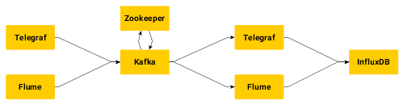

# Setting up Flume & Telegraf with Kafka and InfluxDB


## About this documentation
This documentation assumes that you already know how to set up a cluster of Kafka brokers as well as how to use InfluxDB. If you don't, more information on this topic can be found in the [NILE user guide](http://nile-user-guide.web.cern.ch/). All files that will be used (including the Telegraf and Flume config files) can also be found on [Github](https://github.com/gruffo/CERN-HSSIP-Kafka). The code snippets below were tested on Mac and should work on Linux-based systems. For Windows, please check the documentation of the specific tools mentioned.

The entirety of this documentation was written by Eli Adelhult and Gustav Sörnäs with guidance from Manuel Martin Marquez in 2018 as a part of [CERN's High School Student Internship Programme](https://hssip.web.cern.ch/) (HSSIP).

## Telegraf
First of all, you need to install Telegraf. Visit [influxdata.com/downloads](http://influxdata.com/downloads) and follow the instructions. If the file */etc/telegraf/telegraf.conf* doesn't exist, generate a default config file (which includes all plugins that we will use) with the following command:

```
$ telegraf config > /etc/telegraf/telegraf.conf
```

### Telegraf to Kafka
The [Kafka output plugin](https://github.com/influxdata/telegraf/tree/master/plugins/outputs/kafka) is used to send data to Kafka via Telegraf. Open */etc/telegraf/telegraf.conf* and search for the [[outputs.kafka]] section and replace it with:
```
[[outputs.kafka]]
  brokers = ["server1:port","server2:port", ...]
  topic = "<name of topic>"
  routing_tag = "host"
```
Alternatively you can just uncomment and change the lines of code we are interested in.

For testing purposes you can execute the following command which will send cpu-stats to the Kafka topic specified.
```
$ telegraf --input-filter cpu --output-filter kafka
```

### Kafka to InfluxDB via Telegraf
We use the [Kafka consumer input plugin](https://github.com/influxdata/telegraf/tree/master/plugins/inputs/kafka_consumer) to  read data from Kafka and send it to InfluxDB. This is accomplished by replacing (or uncommenting) the following lines from the [[inputs.kafka_consumer]] section:
```
[[inputs.kafka_consumer]]
  topics = ["<name of topic(s)>"]
  brokers = ["server1:port","server2:port", ...]
  consumer_group = "telegraf_metrics_consumers"
  offset = "newest"
  data_format = "influx"
  max_message_len = 65536
```
Executing the command below makes Telegraf read data from the specified topic(s) and send it to InfluxDB.
```
$ telegraf --input-filter kafka_consumer --output-filter influxdb
```


## Flume
Download Flume from [flume.apache.org/download.html](https://flume.apache.org/download.html). We recommend reading the [data flow model in the user guide](https://flume.apache.org/FlumeUserGuide.html#data-flow-model) in order to understand more about Flume and what it aims to do.

### Flume to Kafka
In the flume installation directory, create a configuration file in *conf*, for example *conf/flume-to-kafka.conf*, and add the following to it.

```
agent.sources = source
agent.channels = channel
agent.sinks = sink

agent.sources.source.type = netcat
agent.sources.source.bind = localhost
agent.sources.source.port = 44444
agent.channels.channel.type = memory

agent.sinks.sink.type = org.apache.flume.sink.kafka.KafkaSink
agent.sinks.sink.topic = <topic>
agent.sinks.sink.brokerList = server1:port,server2:port ...

agent.sources.source.channels = channel
agent.sinks.sink.channel = channel
```
Now, start the flume-ng executable.
```
$ bin/flume-ng agent -n agent --conf conf --conf-file conf/flume-to-kafka.conf
```
Create a new shell and start a new telnet-instance.
```
$ telnet localhost 44444
```
If you write some messages and press ENTER between, the messages should show up in your Kafka topic.

### Kafka to InfluxDB via Flume
Telegraf is most likely a better option for this particular use-case since it nativly supports MQTT, Kafka and InfluxDB. However, if you wish to use Flume you could use one of the following methods:

* **HTTP-API**  
More information on this topic can be found on: [flume-http-sink](https://github.com/hmrc/flume-http-sink) and [InfluxDB guide ](https://docs.influxdata.com/influxdb/v1.5/guides/writing_data/)
* **[Flume-InfluxDB-Sink](https://github.com/szaharici/Flume-InfluxDB-Sink)**
